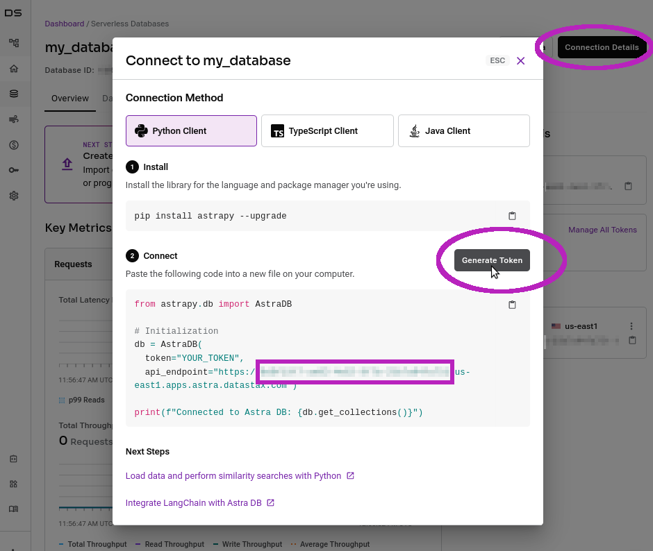

# Hotels LLM Demo with LangChain, CassIO and Astra DB

## What

A full demo app (API + front-end) to search and review hotels, powered by
GenAI, LLMs and embedding vectors.


The demo features:

- LLM-processed user profile;
- vector-search-powered hotel review search;
- LLM-generated hotel summaries based on reviews + user profile (to maximize relevance);
- caching of prompt/response LLM interactions.

Tech stack:

- [Astra DB](https://docs.datastax.com/en/astra-serverless/docs/vector-search/overview.html) as the vector database;
- OpenAI for the LLM and the embeddings;
- React+Typescript for the client;
- FastAPI, LangChain and [CassIO](https://cassio.org) for the API.

_Note that at the time of writing, pending a PR to LangChain, a custom fork of the repo will be installed._

## Prerequisites

You need:

- an [Astra](https://astra.datastax.com) Vector Database (free tier is fine!). **You'll be asked to supply a [Database Administrator token](https://awesome-astra.github.io/docs/pages/astra/create-token/#c-procedure)**, the string starting with `AstraCS:...`;
- likewise, get your [Database ID](https://awesome-astra.github.io/docs/pages/astra/faq/#where-should-i-find-a-database-identifier) ready, you will have to enter it;
- an **OpenAI API Key**. (More info [here](https://cassio.org/start_here/#llm-access), note that out-of-the-box this demo supports OpenAI unless you tinker with the code.)

<details><summary>_Note:_ If you have switched Astra to the **New Vector Developer Experience UI**, click here for instructions on the DB credentials.
</summary>

Go to your database dashboard and click on the "Connection Details" button on the right. A dialog will open with instructions for connecting. You'll do two things:

- click "Generate Token" and copy the `AstraCS:...` string in its entirety once that appears on the dialog;
- locate the `api_endpoint=...` line in the Python code example. The database ID is the sequence after `https://` and the region name in the definition of the endpoint. It looks like `01234567-89ab-cdef-0123-456789abcdef` (and has always this length).



</details>


## How-to (Gitpod)

Click this button, confirm opening of the workspace
(you might need to do a Gitpod login in the process) and wait 3-4 minutes for the full setup to complete:
instructions will show up in the console below, where you'll have
to provide connection details and OpenAI key when prompted.

In the meantime, the app will open in the top panel.

<a href="https://gitpod.io/#https://github.com/cassioml/langchain-hotels-app"></a>


## How-to (local run)

### Setup (API)

Create a `python3.8+` virtualenv and `pip install -r requirements.txt`.

> _Note_: this demo has been tested with Python versions 3.8, 3.9 and 3.10. Please stick to these Python versions, otherwise you'll likely be unable to install all required dependencies (until newer wheels for them are published).

Copy `.env.template` to `.env` and fill the values (see Prerequisites above).

### Prepare database

There are a few scripts to run in sequence which create the necessary tables
on the database and fill them with data. Simply launch the following scripts
one after the other (the script names make it clear what part of the setup they do):

```
python -m setup.2-populate-review-vector-table
python -m setup.3-populate-hotels-and-cities-table
python -m setup.4-create-users-table
python -m setup.5-populate-reviews-table
```

**Note**: the repo comes with a dataset ready for ingestion in the DB, i.e.
already cleaned and made into the correct format. If you are curious about
how _that_ was prepared, we have included the scripts for that - which
you _do not need to run_, to be clear.

<details><summary>Show me the dataset preprocessing steps, I'm curious</summary>

#### Download the dataset

Download `Datafiniti_Hotel_Reviews_Jun19.csv` from [here](https://www.kaggle.com/datasets/datafiniti/hotel-reviews?select=Datafiniti_Hotel_Reviews_Jun19.csv)
(unzip if necessary) and put it into `setup/original`.

#### Clean the input CSV

Refine the original CSV into its "cleaned" version for later use:

```
python -m setup.0-clean-csv
```

#### Calculate embeddings (takes time and some OpenAI calls!)

This script calculates embedding vectors for all reviews
(it actually combines review title and body in a certain way, and the
resulting string is what is sent to the embedding OpenAI service):

```
python -m setup.1-augment-with-embeddings
```

_Note_: this step is time-consuming and makes use of several calls of your
OpenAI account. This is why, to save time and (your) money, the script stores
the resulting vectors in a `precalculated_embeddings.json` file (which uses
a custom compression scheme, see the code!),
so that the "populate review vector table" step does not need to calculate them
anymore. We included the precalculated embeddings in the repo: this is why
you can start the setup from step 2.

</details>


### Launch the API

In the console with the virtual environment active, run:

```
uvicorn api:app
# (optionally add "--reload")
```

Once you see the `Uvicorn running on [address:port]` message, the API is ready.

### Client

#### Setup

_Note: you need a recent version of `Node.js` installed._

On another console, go to the `client` directory
and run `npm install` to get all dependencies.

#### Start the client

Issue the command

```
npm start
```

If it does not open by itself, go to `localhost:3000` on your browser.

_Note_: if you start the API on another address/port, you can specify it like this instead:

```
REACT_APP_API_BASE_URL="http://10.1.1.2:6789" npm start
```

> **Note**: do not worry if you see some API requests being done twice. This is due to the React (v18+) app running in dev mode with `use strict`. See [here](https://stackoverflow.com/questions/72238175/why-useeffect-running-twice-and-how-to-handle-it-well-in-react) for more. _Behaviour in production would be all right._
